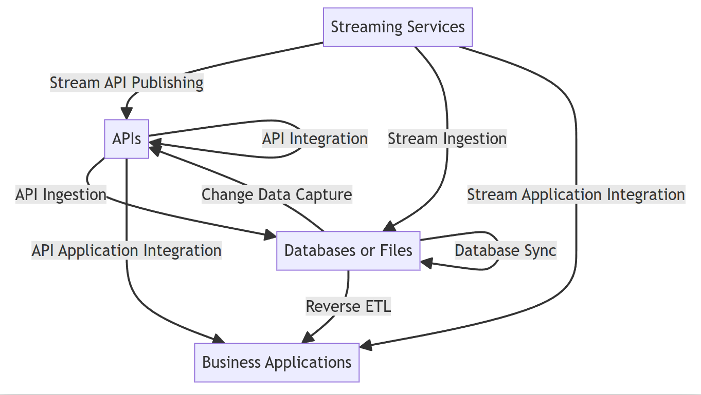
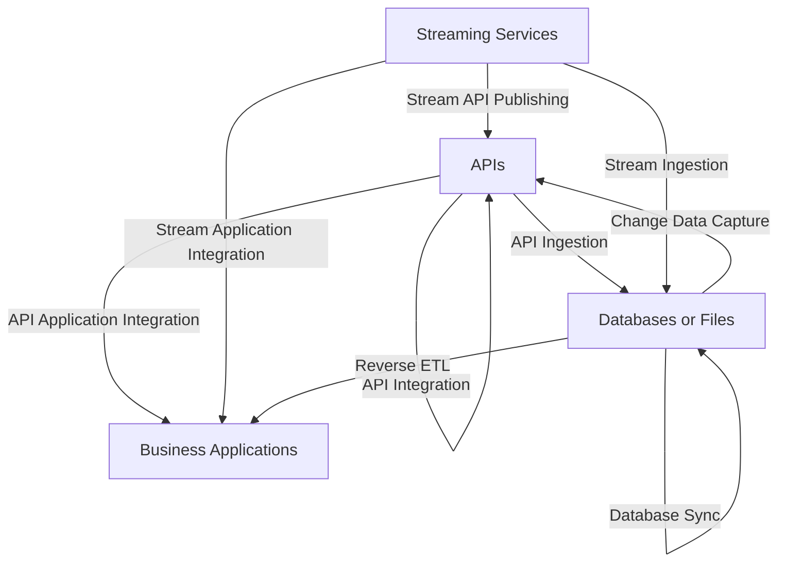

# AUTO ETL Roadmap

Auto ETL is designed to be a code-generation tool
used to build up a large variety of data pipelines.

This code-generation tool is based on an AI-agent-lite functionaly
that operates semi-autonomously to build up data pipelines.

The goal is that given from the user:
 * A description of the task to be performed
 * information about the data sources and sinks
 * information about the infrastructure

It will design, build and deploy a production ready data pipeline.

## Roadmap
There are a few key features that are planned for the future:

The types of data sources and sinks are as follows:
* APIs
* Databases
* Files
* Streams

## Use Cases
The business use-cases are as follows:

## Roadmap

Here's the rough order of features that will be implemented:

Version 0.2:
- [ ] API Ingestion: APIs to Databases or Files

Version 0.3:
- [ ] Reverse ETL: Databases or Files to Business Applications or APIs

Version 0.4:
- [ ] API Integration: APIs to APIs
- [ ] API Application Integration: APIs to Business Applications
- [ ] Database Sync: Databases or Files to Databases or Files

Version 0.5:
- [ ] Documentation publishing and self-hosting
- [ ] SDK generation for APIs
- [ ] Publish Datamodels to API

Version 0.6:
- [ ] Better Business Application Integrations such as BI, CRM, ERP, etc.

Version 0.7:
- [ ] ChatBot Layer for ETL Admin, Monitoring and Data Quering

Version 1.0:
- [ ] Support multiple computation engines
- [ ] Support multiple data storage engines
- [ ] Support multiple data transport engines

Version 2.0:
- [ ] Stream API Publishing: Streaming Services to APIs
- [ ] Stream Ingestion: Streaming Services to Databases or Files
- [ ] Stream Application Integration: Streaming Services to Business Applications
- [ ] Publish to Streaming from any source

## Marketing Terms
Here's a sample of ways we can talk about the features:

1. Database to Database:
   - Data Replication
   - Database Mirroring
   - Database Synchronization
   - Change Data Capture (CDC)

2. API to Database:
   - API Data Ingestion
   - API-Driven ETL
   - API-Powered Data Warehousing
   - Real-Time API Integration

3. Database to API:
   - Database API Monetization
   - Data API Layer
   - Database-Backed API Services
   - API-Enabled Data Access

4. API to API:
   - API Orchestration
   - API Mashups
   - API-to-API Integration
   - Serverless API Composition

5. API to Business Applications:
   - API-Driven Application Integration
   - API-Powered Workflows
   - Seamless API Connectivity
   - API-First Application Ecosystems

6. Streaming Services (like Kafka) to API:
   - Real-Time API Streaming
   - Event-Driven API Architecture
   - Streaming API Gateway
   - API Stream Processing

7. Streaming to Databases:
   - Streaming Data Ingestion
   - Real-Time Data Capture
   - Stream-to-Database Pipelines
   - Streaming ETL for Data Warehousing

8. Streaming to Business Apps:
   - Streaming Application Integration
   - Real-Time App Synchronization
   - Event-Driven Application Architecture
   - Streaming Data Workflows